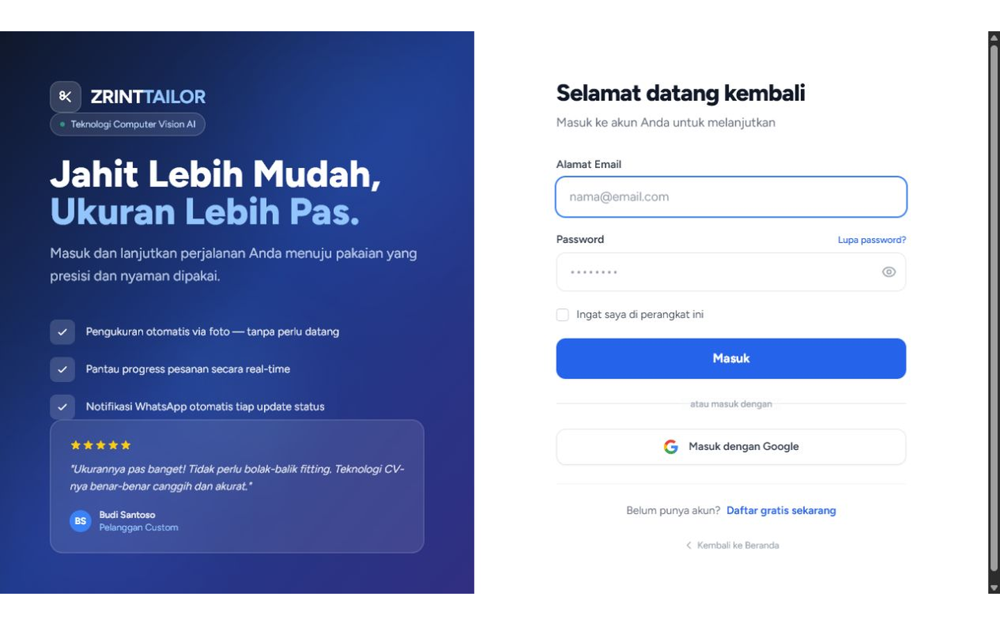
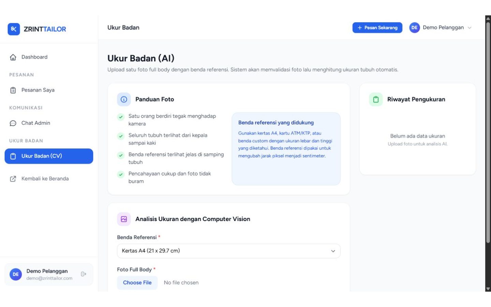
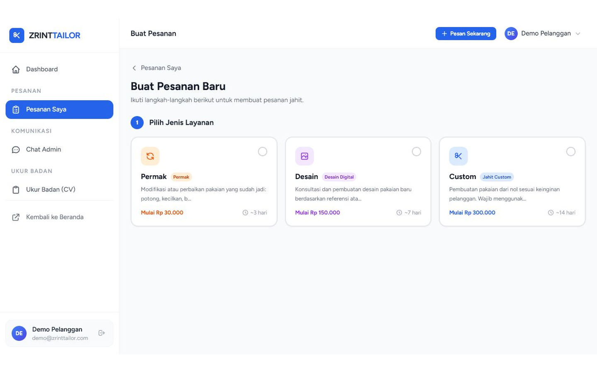

# Tutorial Full Flow ZRINTTAILOR

Tanggal dokumentasi: 12 Juli 2026  
Lingkungan lokal: `http://localhost:8001`  
Target pembaca: penguji, dosen pembimbing, dan developer yang ingin memahami alur utama aplikasi.

## Tujuan Tutorial

Tutorial ini menjelaskan alur penggunaan ZRINTTAILOR dari sisi pelanggan, mulai dari login, mengakses fitur ukur badan berbasis Computer Vision, sampai membuat pesanan jahit custom sesuai ruang lingkup proposal.

Fokus utama flow:

- Pelanggan masuk ke aplikasi.
- Pelanggan melakukan pengukuran badan melalui upload foto full body.
- Sistem memakai benda referensi untuk membantu konversi ukuran.
- Pelanggan membuat pesanan dengan jenis pakaian yang sesuai proposal.
- Sistem tidak memakai ukuran standar S/M/L/XL sebagai dasar layanan custom.

## Akun Demo

Gunakan akun berikut untuk mencoba flow pelanggan:

```text
Email    : demo@zrinttailor.com
Password : password123
```

Jika akun demo belum tersedia, jalankan:

```bash
php artisan db:seed --class=AdminUserSeeder
```

## 1. Buka Halaman Login

Buka aplikasi lokal:

```text
http://localhost:8001/login
```

Halaman login menampilkan identitas ZRINTTAILOR dan form masuk pelanggan.



Langkah:

1. Isi `Alamat Email` dengan `demo@zrinttailor.com`.
2. Isi `Password` dengan `password123`.
3. Klik tombol `Masuk`.

## 2. Masuk ke Area Pelanggan

Setelah login berhasil, pelanggan diarahkan ke area pelanggan. Di area ini tersedia menu utama:

- `Pesanan Saya`
- `Chat Admin`
- `Ukur Badan (CV)`
- `Kembali ke Beranda`


Pada flow tugas akhir, dua menu yang paling penting adalah:

- `Ukur Badan (CV)` untuk menghasilkan ukuran tubuh.
- `Buat Pesanan` atau halaman `pesan` untuk membuat pesanan jahit custom.

## 3. Buka Fitur Ukur Badan

Buka menu:

```text
Ukur Badan (CV)
```

Atau akses langsung:

```text
http://localhost:8001/ukur-badan
```

Halaman ini menjelaskan panduan foto dan form analisis ukuran berbasis Computer Vision.



## 4. Siapkan Foto Pengukuran

Sebelum upload, pastikan foto memenuhi syarat berikut:

1. Satu orang berdiri tegak menghadap kamera.
2. Seluruh tubuh terlihat dari kepala sampai kaki.
3. Benda referensi terlihat jelas di samping tubuh.
4. Pencahayaan cukup.
5. Foto tidak buram.

Benda referensi yang didukung:

- Kertas A4.
- Kartu ATM/KTP.
- Benda custom dengan lebar dan tinggi diketahui.

## 5. Isi Form Analisis Ukuran

Pada form `Analisis Ukuran dengan Computer Vision`, pelanggan memilih benda referensi dan mengupload foto tubuh.

Data penting pada form:

- `Benda Referensi`
- `Lebar Referensi`, jika memakai benda custom
- `Tinggi Referensi`, jika memakai benda custom
- `Upload Foto Full Body`

Form ini dikirim ke endpoint backend:

```text
POST /ukur-badan/analisis
```

Dengan format:

```text
multipart/form-data
```

Artinya, analisis ukuran diarahkan ke backend, bukan dihitung penuh di browser.

## 6. Pahami Hasil Ukur

Hasil ukur digunakan sebagai data ukuran tubuh dalam satuan sentimeter. Sistem custom tailoring tidak memakai ukuran standar seperti S/M/L/XL sebagai dasar utama.

Ukuran yang relevan untuk pola jahit antara lain:

- Dada
- Pinggang
- Pinggul
- Lebar bahu
- Panjang lengan
- Tinggi badan

Catatan untuk tugas akhir: jika ingin memperkuat bagian pengujian, hasil ukur dari Computer Vision sebaiknya dibandingkan dengan ukuran manual penjahit sebagai ground truth.

## 7. Buka Halaman Buat Pesanan

Buka menu:

```text
Buat Pesanan
```

Atau akses langsung:

```text
http://localhost:8001/pesan
```

Halaman ini digunakan pelanggan untuk memilih layanan, detail pakaian, ukuran, alamat, dan pengiriman.


## 8. Pilih Layanan

Pada langkah pertama, pelanggan memilih jenis layanan. Contoh layanan yang tampil:

- Permak
- Desain Digital
- Jahit Custom

Untuk flow utama proposal, layanan yang paling relevan adalah `Jahit Custom`, karena proposal membahas proses pemesanan pakaian custom dengan rekomendasi ukuran.

## 9. Pilih Jenis Pakaian Sesuai Proposal

Pada bagian detail pakaian, pelanggan dapat memilih jenis pakaian yang sesuai ruang lingkup proposal:

- Kemeja
- Baju Dinas
- Baju Sekolah
- Baju Koko
- Kebaya
- Gamis
- Celana Kain
- Rok Kain

Opsi seperti denim/jeans tidak digunakan karena proposal membatasi celana dan rok pada bahan kain.

## 10. Isi Warna, Bahan, dan Deskripsi

Pelanggan mengisi detail pakaian:

- Warna
- Bahan
- Deskripsi model atau catatan khusus
- Gambar referensi, jika ada

Contoh bahan yang tersedia:

- Katun
- Linen
- Silk
- Sifon
- Brokat
- Jersey
- Wool
- Polyester

## 11. Pilih Sumber Ukuran

Pelanggan dapat memakai ukuran dari hasil Computer Vision atau mengisi manual.



Jika memilih manual, isi ukuran dalam sentimeter, misalnya:

- Dada
- Pinggang
- Pinggul
- Lebar bahu
- Panjang lengan
- Tinggi badan

Catatan penting:

```text
Sistem tidak memakai ukuran standar S/M/L/XL untuk layanan custom.
```

## 12. Lengkapi Alamat dan Nomor Penerima

Setelah detail pakaian dan ukuran diisi, pelanggan melengkapi alamat pengiriman:

- Provinsi
- Kota/Kabupaten
- Kecamatan
- Kelurahan/Desa
- RT/RW
- Kode pos
- Detail alamat
- Nomor telepon penerima

Alamat dibutuhkan agar pesanan dapat diproses dan dikirim ke pelanggan.

## 13. Buat Pesanan

Setelah semua data lengkap, klik:

```text
Buat Pesanan
```

Sistem akan melakukan validasi data. Jika ada field wajib yang kosong, pelanggan harus melengkapinya terlebih dahulu.

## Ringkasan Flow

```text
Login
  -> Dashboard Pelanggan
  -> Ukur Badan (CV)
  -> Upload Foto Full Body + Benda Referensi
  -> Analisis Ukuran Backend
  -> Buat Pesanan
  -> Pilih Layanan Jahit Custom
  -> Pilih Jenis Pakaian Sesuai Proposal
  -> Pilih/Gunakan Ukuran
  -> Isi Alamat
  -> Buat Pesanan
```

## Kesesuaian dengan Proposal

Flow ini sesuai dengan proposal karena:

- Pengukuran dimulai dari foto full body.
- Sistem memakai benda referensi.
- Hasil ukuran diperlakukan sebagai ukuran sentimeter untuk kebutuhan jahit.
- Pilihan pakaian mengikuti ruang lingkup proposal.
- Celana dan rok diarahkan sebagai kain.
- Sistem custom tidak memakai preset S/M/L/XL.

## Catatan Pengembangan Berikutnya

Agar dokumentasi tugas akhir lebih kuat, tambahkan fitur evaluasi akurasi:

1. Simpan hasil ukur Computer Vision.
2. Simpan ukuran manual penjahit sebagai ground truth.
3. Hitung error absolut per atribut ukuran.
4. Hitung MAE.
5. Tampilkan atau ekspor laporan evaluasi.

Formula:

```text
MAE = jumlah seluruh error absolut / jumlah data uji
```

Contoh tabel evaluasi:

| Foto | Atribut | Hasil CV | Ground Truth | Error Absolut |
| --- | --- | ---: | ---: | ---: |
| sample-001 | Dada | 92.0 | 91.0 | 1.0 |
| sample-001 | Pinggang | 78.0 | 80.0 | 2.0 |

## Lampiran Screenshot

| No | Tampilan | File |
| --- | --- | --- |
| 1 | Login | `docs/screenshots/01-login.png` |
| 2 | Dashboard pelanggan | `docs/screenshots/02-dashboard-pesan.png` |
| 3 | Ukur badan | `docs/screenshots/03-ukur-badan.png` |
| 4 | Buat pesanan | `docs/screenshots/04-buat-pesanan.png` |
| 5 | Input ukuran manual | `docs/screenshots/05-input-ukuran-manual.png` |
